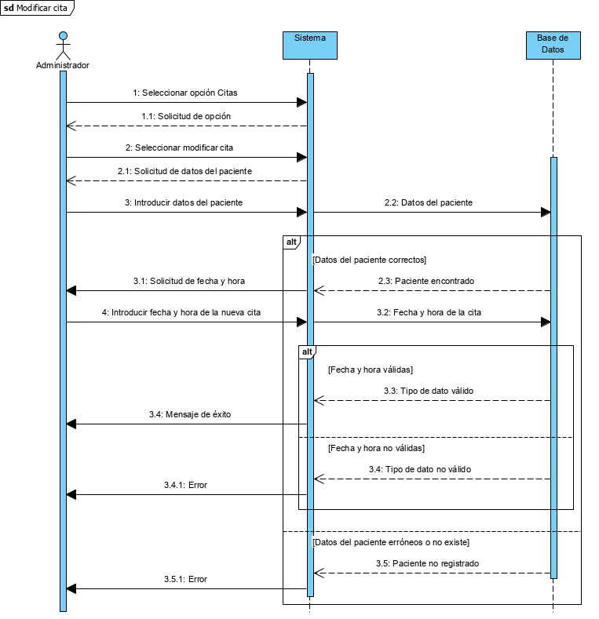
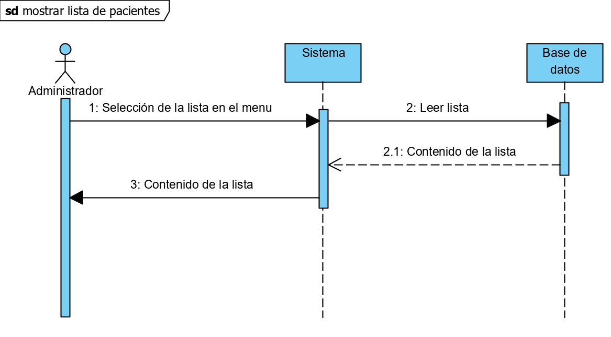
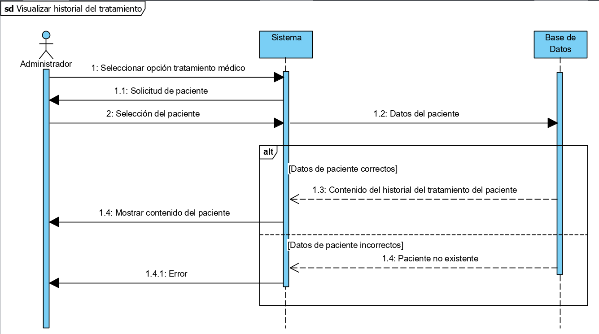

# Diagramas secuenciales
Diagramas secuenciales de los casos de uso mas sofisticados del programa.

### 01. Buscar Usuario

### 02. Modificar usuario

### 03. Añadir cita.

### 04. Modificar cita.

### 05. Añadir paciente.

### 06. Mostrar lista de pacientes.

### 07. Visualizar historial médico.

### 08. Visualizar historial de tratamiento.

### 10. Añadir tratamiento.

### 12. Dar de alta a un paciente.

